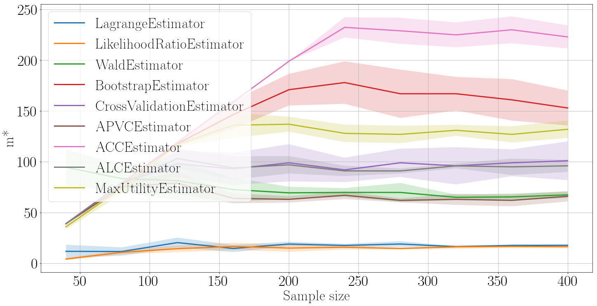

######################
Sample Size Estimation
######################

Requirements
============
This repositorie uses implementation code for a sample size estimation task. The `source code <https://github.com/andriygav/SampleSizeLib/tree/master/src>`_ for the problem of the sample size estimation for linear models.

Description
===========

This repository contains computation experiment to the article: *Numerical methods of minimum sufficient sample size estimation for linear and logistic regression*.

Depending On Available Sample Size Experiment
---------------------------------------------
This part of computation experiment shows how different models depends on available sample size. We are using Boston Housing dataset for illustration. The dataset is available through the `link <https://github.com/ttgadaev/SampleSizeEstimation/blob/master/datasets/boston.csv>`_.

Many Datasets Experiment
------------------------
This part of computation experiment shows how different models works on different datasets. We are using different public available datasets. A description of all datasets is available through the `link <https://github.com/ttgadaev/SampleSizeEstimation/blob/master/datasets>`_.

+-------------------------+---------------+---------------+---------------+---------------+---------------+
|                         |      Boston m*|    Diabetes m*| ForestFires m*|       Servo m*|         NBA m*|
+-------------------------+---------------+---------------+---------------+---------------+---------------+
|        LagrangeEstimator|             18|             25|             44|             38|            218|
+-------------------------+---------------+---------------+---------------+---------------+---------------+
| LikelihoodRatioEstimator|             17|             25|             43|             18|            110|
+-------------------------+---------------+---------------+---------------+---------------+---------------+
|            WaldEstimator|             66|             51|             46|             76|            200|
+-------------------------+---------------+---------------+---------------+---------------+---------------+
|       BootstrapEstimator|            178|            441|            171|            120|           1328|
+-------------------------+---------------+---------------+---------------+---------------+---------------+
| CrossValidationEstimator|            113|            117|             86|             60|            405|
+-------------------------+---------------+---------------+---------------+---------------+---------------+
|            APVCEstimator|             98|            167|            351|             20|           1328|
+-------------------------+---------------+---------------+---------------+---------------+---------------+
|             ACCEstimator|            228|            441|            346|             65|           1328|
+-------------------------+---------------+---------------+---------------+---------------+---------------+
|             ALCEstimator|             98|            267|            516|             25|           1328|
+-------------------------+---------------+---------------+---------------+---------------+---------------+
|      MaxUtilityEstimator|            148|            172|            206|            105|            925|
+-------------------------+---------------+---------------+---------------+---------------+---------------+
